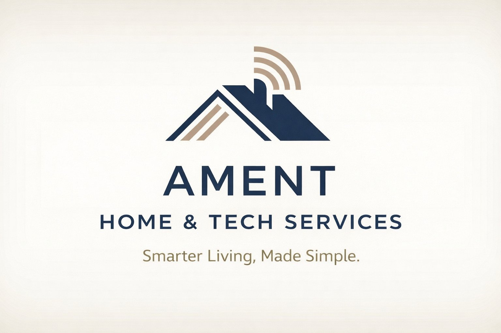

<p align="center">
  
</p>

<h1 align="center">Ament Home & Tech Services</h1>

<p align="center">
  Production marketing and booking site for a smart-home and security-camera installation company in St.&nbsp;Augustine, FL.<br>
  Built with Next.js 14, TypeScript, the Claude API, and Resend.
</p>

---

## What this is

Ament Home & Tech Services installs CCTV systems, smart-home automation, and residential tech for homes and small businesses. This repository is the company's live site: a marketing landing page, a multi-step booking wizard, an AI-assisted project scoping tool, and the email pipeline that turns a visitor's form submission into an actionable booking request in the owner's inbox.

Everything runs on Next.js App Router — there is no separate backend. Server-side work (AI calls, email delivery) happens in API route handlers, so the whole product deploys as a single app.

## Features

- **Scroll-driven hero animation** — the landing page plays a frame-by-frame image sequence tied to scroll position, with the first frame preloaded for fast LCP.
- **Multi-step booking wizard** — visitors pick services, add a care plan, enter contact details, and submit. The owner receives a formatted email with the full order summary.
- **AI project scoping** — for custom projects, a visitor describes what they want in plain language. Claude returns a structured brief: summary, recommended services, complexity estimate, and discovery-call questions the owner can ask on the first phone call.
- **AI-assisted quotes** — the quote flow combines Claude's estimate with the visitor's answers and emails both to the owner.
- **Careers intake** — a job application form for licensed installers, delivered by email.
- **Graceful degradation** — if an API key is missing, AI features return a friendly "temporarily unavailable" message instead of breaking the booking flow.

## Tech stack

| Layer | Choice | Why |
|---|---|---|
| Framework | [Next.js 14](https://nextjs.org) (App Router) | One deployable unit for pages and API routes |
| Language | TypeScript | Typed payloads for every form → API contract |
| UI | React 18, [Headless UI](https://headlessui.com) | Accessible modals and interactive components |
| AI | [Claude API](https://docs.anthropic.com) (`@anthropic-ai/sdk`) | Project briefs and quote estimates |
| Email | [Resend](https://resend.com) | Booking, quote, and application notifications |
| Fonts | Playfair Display + Lato (via `next/font`) | Self-hosted, zero layout shift |

## Getting started

### Prerequisites

- Node.js 18+
- A [Resend](https://resend.com) API key (free tier works for testing)
- An [Anthropic](https://console.anthropic.com) API key (optional — only AI features need it)

### Setup

```bash
# 1. Install dependencies
npm install

# 2. Configure environment variables
cp .env.local.example .env.local
#    ...then edit .env.local with your keys

# 3. Run the dev server
npm run dev
```

Open [http://localhost:3000](http://localhost:3000).

### Environment variables

| Variable | Required | Purpose |
|---|---|---|
| `RESEND_API_KEY` | Yes | Sends booking, quote, and application emails |
| `BOOKING_RECIPIENT_EMAIL` | Yes | Inbox that receives new booking requests |
| `BOOKING_FROM_EMAIL` | Yes | Verified "from" address (use `onboarding@resend.dev` for testing) |
| `ANTHROPIC_API_KEY` | No | Enables AI project briefs and quote estimates |

## Project structure

```
app/
├── page.tsx                  # Landing page (hero, services, pricing, care plans)
├── book/page.tsx             # Booking wizard page
├── about/page.tsx            # Company story
├── careers/page.tsx          # Job application form
├── components/
│   ├── BookingWizard.tsx     # Multi-step service selection and checkout
│   ├── AIScopingPanel.tsx    # Free-text project description → Claude brief
│   ├── BookingModal.tsx      # Contact details and submission
│   ├── ScrollVideoSection.tsx# Scroll-position-driven frame animation
│   └── ServiceTierCard.tsx   # Pricing tier display
└── api/
    ├── booking/route.ts      # POST — emails a formatted booking summary
    ├── quote/route.ts        # POST — Claude estimate + emailed quote request
    ├── ai-brief/route.ts     # POST — Claude-generated project brief
    └── apply/route.ts        # POST — emails a job application
public/frames/                # Image sequences for scroll animations
```

## API routes

All routes accept `POST` with a JSON body and return JSON. They validate input, escape user-supplied HTML before it reaches an email template, and fail with clear status codes (`400` bad input, `503` missing configuration, `500` upstream failure).

| Route | Input | Output |
|---|---|---|
| `/api/booking` | Contact info + selected services | Sends order-summary email, returns confirmation |
| `/api/quote` | Service category + questionnaire answers | Claude estimate, emailed to owner and returned to visitor |
| `/api/ai-brief` | Project description, size, platform, priorities | Structured project brief (summary, services, complexity, discovery questions) |
| `/api/apply` | Applicant details and license info | Sends application email |

### How the AI scoping works

`/api/ai-brief` sends the visitor's description to Claude with a system prompt that constrains the output to four fixed sections — summary, recommended services, complexity rating, and discovery-call questions. Constraining the shape of the response is what makes it useful: the owner gets the same scannable brief for every lead instead of a free-form essay, and the front end can render it predictably.

## Deployment

The site deploys to [Vercel](https://vercel.com) with zero configuration — connect the repo, add the four environment variables, and push to `main`. API routes run as serverless functions automatically.

```bash
npm run build   # verify a production build locally first
```

## About this repository

This is the real codebase behind a family-run business — the booking requests land in a real inbox and the phone number on the site rings a real phone. Internal business documents (pricing worksheets, financials) are deliberately excluded from version control; see `.gitignore`.

Questions about the project? Open an issue.
